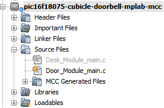

<!-- Please do not change this logo with link -->
[](https://www.microchip.com)

# Cubicle Doorbell

This example shows how to create a wireless, cubicle doorbell using a capacitve touch button, 2 bluetooth modules, and a NeoPixel LED strip as a soundless doorbell.

## Related Documentation

- [PIC16F18075 Data Sheet](https://ww1.microchip.com/downloads/aemDocuments/documents/MCU08/ProductDocuments/DataSheets/PIC16F18054-55-74-75-28-40-Pin-Micorocontroller-Data-Sheet-40002338.pdf)
- [PIC16F18075 Family Product Page](https://www.microchip.com/en-us/products/microcontrollers-and-microprocessors/8-bit-mcus/pic-mcus/pic16f18076?utm_source=GitHub&utm_medium=TextLink&utm_campaign=MCU8_MMTCha_pic16f18076&utm_content=pic16f18075-cubicle-doorbell-mplab-mcc-github)
- [Wireless Cubicle Doorbell Application Note](https://www.microchip.com/en-us/application-notes/an3313)
- [RNBD451 User Guide](https://onlinedocs.microchip.com/oxy/GUID-26457D23-798C-47B0-9F40-C5DA6E995C6F-en-US-1/index.html)


## Software Used

- [MPLAB® X IDE](https://www.microchip.com/en-us/tools-resources/develop/mplab-x-ide?utm_source=GitHub&utm_medium=TextLink&utm_campaign=MCU8_MMTCha_pic16f18076&utm_content=pic16f18075-cubicle-doorbell-mplab-mcc-github) **6.10** or newer
- [MPLAB XC8](https://www.microchip.com/en-us/tools-resources/develop/mplab-xc-compilers?utm_source=GitHub&utm_medium=TextLink&utm_campaign=MCU8_MMTCha_pic16f18076&utm_content=pic16f18075-cubicle-doorbell-mplab-mcc-github) **2.41** or a newer compiler 
- [MPLAB Code Configurator (MCC)](https://www.microchip.com/en-us/tools-resources/configure/mplab-code-configurator?utm_source=GitHub&utm_medium=TextLink&utm_campaign=MCU8_MMTCha_pic16f18076&utm_content=pic16f18075-cubicle-doorbell-mplab-mcc-github) **5.7.7** or newer 
- [MPLAB Melody Library](https://www.microchip.com/en-us/tools-resources/configure/mplab-code-configurator?utm_source=GitHub&utm_medium=TextLink&utm_campaign=MCU8_MMTCha_pic16f18076&utm_content=pic16f18075-cubicle-doorbell-mplab-mcc-github) **2.1.12** or newer 
- [Microchip PIC16F1xxxx Series Device Support pack](https://packs.download.microchip.com/) **1.18.352** or newer Device Pack

## Hardware Used
- [PIC16F18075](https://www.microchip.com/en-us/product/pic16f18075?utm_source=GitHub&utm_medium=TextLink&utm_campaign=MCU8_MMTCha_pic16f18076&utm_content=pic16f18075-cubicle-doorbell-mplab-mcc-github) x2
- [Curiosity HPC Development Board](https://www.microchip.com/en-us/development-tool/DM164136?utm_source=GitHub&utm_medium=TextLink&utm_campaign=MCU8_MMTCha_pic16f18076&utm_content=pic16f18075-cubicle-doorbell-mplab-mcc-github) x2
- [RNBD451 BLE Module](https://www.microchip.com/en-us/development-tool/EV25F14A?utm_source=GitHub&utm_medium=TextLink&utm_campaign=MCU8_MMTCha_pic16f18076&utm_content=pic16f18075-cubicle-doorbell-mplab-mcc-github&utm_bu=MCU08) x2
- [Cap Touch Click](https://www.mikroe.com/cap-touch-click)
- [Adafruit NeoPixel](https://www.adafruit.com/product/1426)
- Jumper wires

## Setup - Wiring

The hardware for this code example consists of two separate parts connected wirelessly using their respective Bluetooth modules.  The two parts are the Door Module which would serve as the traditional doorbell in this demonstration, and the Desk Module which would serve as the traditional door chime in the demonstration.

**Note:** This demo was originally created using Bluetooth classic using the [RN4876 module](https://www.mikroe.com/rn4678-click), but was later ported to BLE using the [RNBD451 module](https://www.microchip.com/en-us/development-tool/EV25F14A?utm_source=GitHub&utm_medium=TextLink&utm_campaign=MCU8_MMTCha_pic16f18076&utm_content=pic16f18075-cubicle-doorbell-mplab-mcc-github&utm_bu=MCU08). The two modules are interchangable, expect for 1 line of code. However, the entire setup should work for both.

### Door Module Wiring

The Door Module includes the Cap Touch Click and one RNBD451 Bluetooth Module.  The Cap Touch Click is used for capturing if someone is at the door when they press the touch button, and the RNBD451 Bluetooth Module is used to send the signal to the Desk Module.

The Cap Touch Click connects to the PIC16F18075 by connecting the OUT pin on the Click board to an input pin (RB0) of the microcontroller. The MOD pin on the Click board determines the mode of operation (Fast / low power mode) and is connected to RD1 of the PIC16F18075.

The RNBD451 Bluetooth Module connects to the PIC16F18075 through the RTS, CTS, RXD, TXD, RST, and SW_RST pins. The CTS and TXD pins are configured as input pins on the PIC16F18075 while the RTS, RXD, RST, and SW_RST pins are configured as output pins.

Figure 1 shows the connections made between the Cap Touch Click, the RNBD451 Bluetooth Module, and the PIC16F18075 for the door module.

*Figure 1 - Door Module Circuit Diagram*


### Desk Module Wiring
The Desk Module includes the Adafruit NeoPixel Stick and one RN4678 Bluetooth Click. The RN4678 Bluetooth Click is used to receive the signal from the Door Module when somebody presses the capacitive touch button; the Adafruit NeoPixel Stick then flashes to get the attention of the person inside of the cubicle.

The Adafruit NeoPixel Stick connects to the PIC16F18075 by connecting the DIN pin to any output pin of the microcontroller. In this example, RA0 was selected as the output pin. A 4-pin header will need to be soldered onto the back of the Adafruit NeoPixel before connecting to the PIC16F18075.  Figure 2 shows where to connect the 4-pin header (see the red box).

*Figure 2 - Adafruit NeoPixel - back side*


The RNBD451 Bluetooth Module connects to the PIC16F18075 the same way as on the door module.

Figure 3 shows the connections made between the Adafruit NeoPixel Stick, RNBD451 Bluetooth Module, and the PIC16F18075 for the desk module.

*Figure 3 - Desk Module Circuit Diagram*


## Setup - Programming
### Door/Desk Module Environment Setup
- Download, install, and open MPLABX IDE version 6.00 (or newer).

- Download and install the XC8 C-Compiler version 2.36 (or newer).

- Open the 'pic16f18075-cubicle-doorbell-mplab-mcc.X' project as shown in Figure 4.

*Figure 4 - Open Project Menu in MPLABX*


### Program Code, Configurations, and Functions Overview

The project file above includes all the needed code and configurations for both the Door and Desk modules.  There are two main.c files that contain the driving code for each of the modules (Figure 5 below).  By selecting the configuration that matches the module and free/pro status (see Table 1 and Figure 6 below), one of the main.c files will be excluded from being programmed (gray .c file in Figure 5). This exclusion results in the correct main.c file being programmed to the device for the selected module, so that the same MPLABX project can be used for both the Door module and Desk module.

*Figure 5 - Main.c File Organization using pro_door configuration setting*




*Figure 6 - Configuration List for MPLABX*


*Table 1 - Configuration List selection by Module and Free/Pro setting*

| Module      | Free/Pro | Configuration     |
| :---        |    :----:   |          ---: |
| Door      | Pro       | pro_door   |
| Door   | Free        | free_door      |
| Desk   | Pro        | pro_desk      |
| Desk   | Free        | free_desk      |

Each of the main.c files will use a series of functions that are built utilizing the existing APIs generated from the Melody configuration.  Table 2 and Table 3 below each give an overview of the functions used for either the NeoPixel or RNBD451 Bluetooth Module. 

#### NeoPixel Functions
There are 7 custom-written functions used to control the NeoPixel in this example. Each function and description is listed in Table 2. These functions can be found within the Desk_Module_main.c file.

*Table 2 - NeoPixel Functions and Descriptions*

| Function      | Description |
| :----:        |    :----:   |
| ``` onePulse() ```      | Send a 1-code, a HIGH, using the correct timing to the NeoPixel       |
| ``` zeroPulse() ```   | Send a 0-code, a LOW, using the correct timing to the NeoPixel        |
| ``` LED_send_byte(K) ```  | Check the K byte for if you should send a 1-code or 0-code        |
| ```LED_Array(R, G, B)```|Input the values R,G,B (max of 255) to set the brightness for each color for an individual LED. Sends in the correct order so the NeoPixel can understand|
| ``` RED() ```   | Make all 8 LEDs turn to the brightest Red possible        |
| ``` OFF() ```   | Turn all 8 LEDs off        |
| ``` RED_BLINK_500ms() ```| All 8 LEDs blink Red and then turn off at a 500ms interval        |

#### RNBD451 Functions
There are 5 custom written functions used to control the RNBD451 in this example. Each function and description is listed in Table 3. These functions can be found within both the Desk_Module_main.c file and the Door_Module_main.c file.
  
*Table 3 - RNBD451 Functions and Descriptions*

| Function   | Description |
| :----:       |    :----:   |
| ``` BT_initialConditions() ```  | Set initial conditions for RNBD451 Bluetooth Module |
| ``` BT_initialize() ```  | Put the RNBD451 Bluetooth Module into a state where is it able to recieve EUSART data |
| ``` BT_enterCommandMode() ```  | Sends the '$$$' command over EUSART which enters the RNBD451 Bluetooth Module into Command Mode |
| ``` BT_connect() ```  | Connect to the device which matches the specificed MAC address (stored within the function)  |

There are 4 `#defines` that need changed depending on your configuration in `Desk_Module_main.c`, lines 23-27:

```c
#define NUM_FLASHES 3 // number of times LED array flashes
#define NUM_LEDS 8 // number of LEDs used
#define MAC_ADDR "9C956E40667B" // MAC address of device
#define RNBD451 // this module makes code run BLE commands
//#define RN4678 // this module makes code run BT classic commands
```
[This webpage](https://onlinedocs.microchip.com/oxy/GUID-A87FCFF4-A9D1-4EA7-905C-92DA42132554-en-US-1/GUID-113B0BEA-BE7E-4BA9-AD01-09DD06A2C917.html) details how to find the MAC address for the RNBD451 module, and [this one](https://ww1.microchip.com/downloads/en/DeviceDoc/RN4678-Bluetooth-Dual-Mode-Module-Command-Reference-User-Guide-DS50002506C.pdf) shows for the RN4678 module.

## Programming the PIC16F18075
**Step 1:** The Curiosity HPC board includes a programmer that can program the PIC16F18075. Simply connect it to your computer via USB, and when you click the **Make and Program Device** button, the the device will program. Make sure you have the correct configuration selected from the configuration list dropdown for the device you are programming, either Desk or Door side.

*Figure 8 - Make and Program Device Button*


*Figure 9 - Device Programming Successful*


## Operation
After programming both the Desk and Door modules, you should have a working doorbell when you touch the capacitive touch click.

*Doorbell working*


### How to change any other Bluetooth settings

The RNBD451 Bluetooth Click has many different settings that are not described within this example.  For any additional setting changes, the following steps should be followed:
     
1. Make sure that all the RNBD451 Bluetooth Click pins are connected to the PIC16F18075 (see Figure 1 or Figure 3 above)

2. Disconnect the TXD and RXD connections between the PIC16F18075 and the RN4678 Bluetooth Click.

3. Using a USB to UART device, connect the TXD and RXD pins from the RNBD451 Bluetooth Module to that device.

4. Now follow the instructions used with the command guide for changing any of the settings.  The command guide can be found above under the link labeled 'RNBD451 User Guide'.
     
## Summary
This example has shown how to use a Cap Touch Click, an AdaFruit NeoPixel, and 2 RNBD451 Bluetooth Modules to create a Cubicle Doorbell system that uses the PIC16F18075.