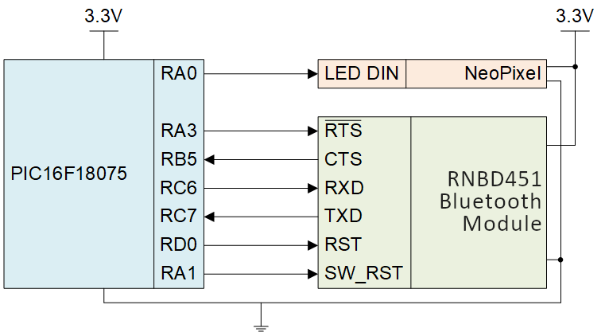
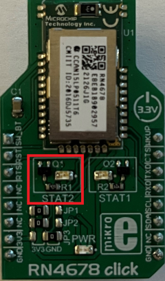
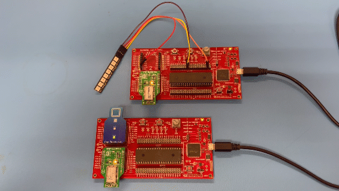

<!-- Please do not change this logo with link -->
[](https://www.microchip.com)

# Cubicle Doorbell

This example shows how configure a Cap Touch Click, an Adafruit NeoPixel, and two RN4678 Bluetooth Clicks into a doorbell which allows someone to get a coworker's attention if they are not directly looking at the door of their cubicle.


## Related Documentation

- [PIC16F18075 Data Sheet](https://ww1.microchip.com/downloads/en/DeviceDoc/PIC18F27-47-57Q43-Data-Sheet-DS40002147E.pdf) <!--Is this available online yet?-->
- [PIC16F18075 Family Product Page](https://www.microchip.com/wwwproducts/en/PIC16F18075)
- [RN4678 User Guide](https://ww1.microchip.com/downloads/en/DeviceDoc/RN4678-Bluetooth-Dual-Mode-Module-Command-Reference-User-Guide-DS50002506C.pdf)


## Software Used

- [MPLAB® X IDE](http://www.microchip.com/mplab/mplab-x-ide) **6.00** or newer
- [MPLAB® Xpress IDE](https://www.microchip.com/en-us/development-tools-tools-and-software/mplab-xpress) (alternative to MPLAB® X IDE) <!--Does this apply to this example?-->
- [MPLAB® XC8](http://www.microchip.com/mplab/compilers) **2.36** or a newer compiler 
- [MPLAB® Code Configurator (MCC)](https://www.microchip.com/en-us/tools-resources/configure/mplab-code-configurator) **5.1.0** or newer <!--Update/double check the version-->
- [MPLAB® Melody Library](https://www.microchip.com/en-us/tools-resources/configure/mplab-code-configurator) **2.1.12** or newer <!--Update/double check the version-->
- [Microchip PIC16F1xxxx Series Device Support pack](https://packs.download.microchip.com/) **1.10.174** or newer Device Pack

## Hardware Used
- [MPLAB® PICkit™ 4 In-Circuit Debugger](https://www.microchip.com/en-us/development-tool/PG164140)
- [Cap Touch Click](https://www.mikroe.com/cap-touch-click)
- [Adafruit NeoPixel](https://www.adafruit.com/product/1426)
- [RN4678 Bluetooth Click](https://www.mikroe.com/rn4678-click) x2
- Large Breadboard x2
- Jumper wires

## Setup - Wiring
### Door Module Wiring

The Door Module includes the Cap Touch Click and one RN4678 Bluetooth Click.  The Cap Touch Click is used for capturing if someone is at the door and the RN4678 Bluetooth Click is used to send the signal to the Desk Module.

The Cap Touch Click connects to the PIC16F18075 by connecting the OUT pin to any input pin. In this example, RB0 was selected as the input pin. The MOD pin on the Click determines the mode of operation and is connected to RD1. The Cap Touch Click shares the ground, both pins, with the PIC16F18075 but does not share the 3.3VDC power.

The RN4678 Bluetooth Click connects to the PIC16F18075 through the RTS, CTS, RXD, TXD, RST, and SW_RST pins. The CTS and TXD pins are configured as input pins while the RTS, RXD, RST, and SW_RST pins are configured as output pins. The RN4678 Bluetooth Click shares both the power (3.3VDC) and ground pins with the PIC16F18075. 

Figure 1 shows the connections made between the Cap Touch Click and RN4678 Bluetooth Click and the PIC16F18075 for the door module.

*Figure 1 - Door Module Circuit Diagram*


### Desk Module Wiring
The Desk Module includes the Adafruit NeoPixel and one RN4678 Bluetooth Click.  The Adafruit NeoPixel is used to get the attention of the person inside of the cubicle and the RN4678 Bluetooth Click is used to receive the signal from the Door Module.

The Adafruit NeoPixel connects to the PIC16F18075 by connecting the DIN pin to any output pin. In this example, RA0 was selected as the output pin. A 4-pin header will need to be soldered onto the back of the Adafruit NeoPixel before connecting to the PIC16F18075.  Figure 2 shows where to connect the 4-pin header (see the red box).  The Adafruit NeoPixel shares the ground, both pins, with the PIC16F18075 but does not share the 5VDC power. 


*Figure 2 - Adafruit NeoPixel - back side*


The RN4678 Bluetooth Click connects to the PIC16F18075 through the RTS, CTS, RXD, TXD, RST, and SW_RST pins. The CTS and TXD pins are configured as input pins while the RTS, RXD, RST, and SW_RST pins are configured as output pins. The RN4678 Bluetooth Click shares both the power (3.3VDC) and ground pins, both pins, with the PIC16F18075. 

Figure 3 shows the connections made between the Adafruit NeoPixel and RN4678 Bluetooth Click and the PIC16F18075 for the desk module.


*Figure 3 - Desk Module Circuit Diagram *





## Setup - Programming
### Door/Desk Module Environment Setup
- Download, install, and open MPLABX IDE version 6.00 (or newer).

- Download and install the XC8 C-Compiler version 2.36 (or newer).

- Open the 'pic16f18075-cubicle-doorbell-mplab-mcc.X' project as shown in Figure 4.

*Figure 4 - Open Project Menu in MPLABX*


### Program Code, Configurations, and Functions Overview

The project file above includes all the needed code and configurations for both the Door and Desk modules.  There are two main.c files that contain the driving code for each of the modules.  By selecting the configuration that matches the module and free/pro status (see Table 1 and Figure 5 below), one of the main.c files will be excluded from being programmed. This exclusion results in the correct main.c file being programmed to the device for the selected module, so that the same MPLABX project can be used for both the Door module and Desk module.

*Figure 5 - Configuration List for MPLABX*


*Table 1 - Configuration List selection by Module and Free/Pro setting*

| Module      | Free/Pro | Configuration     |
| :---        |    :----:   |          ---: |
| Door      | Pro       | pro_door   |
| Door   | Free        | free_door      |
| Desk   | Pro        | pro_desk      |
| Desk   | Free        | free_desk      |

Each of the main.c files will use a series of functions that are built utilizing the existing APIs generated from the Melody configuration.  Table 2 and Table 3 below each give an overview of the functions used for either the NeoPixel or RN4678 Bluetooth Click. 

#### NeoPixel Functions
There are 7 functions used to control the NeoPixel in this example. Each function and description is listed in Table 2.

*Table 2 - NeoPixel Functions and Descriptions*

| Function      | Description |
| :----:        |    :----:   |
| ``` onePulse() ```      | Send a 1-code, a HIGH, using the correct timing to the NeoPixel       |
| ``` zeroPulse() ```   | Send a 0-code, a LOW, using the correct timing to the NeoPixel        |
| ``` LED_send_byte(K) ```  | Check the K byte for if you should send a 1-code or 0-code        |
| ```LED_Array(R, G, B)```|Input the values R,G,B (max of 255) to set the brightness for each color for an individual LED. Sends in the correct order so the NeoPixel can understand|
| ``` RED() ```   | Make all 8 LEDs turn to the brightest Red possible        |
| ``` OFF() ```   | Turn all 8 LEDs off        |
| ``` RED_BLINK_500ms ```| All 8 LEDs blink Red and then turn off at a 500ms interval        |

#### RN4678 Functions
There are 5 functions used to control the RN4678 in this example. Each function and description is listed in Table 3.
  
*Table 3 - RN4678 Functions and Descriptions*

| Function   | Description |
| :----:       |    :----:   |
| ``` BT_initialConditions() ```  | Set initial conditions for RN4678 Click |
| ``` BT_initialize() ```  | Put the RN4678 Click into a state where is it able to recieve EUSART data |
| ``` BT_enterCommandMode() ```  | Sends the '$$$' command over EUSART which enters the RN4678 Click into Command Mode |
| ``` BT_scan() ```  | Scan for available Bluetooth Connections |
| ``` BT_connect() ```  | Connect to the device which matches the specificed MAC address (stored within the function)  |

### Programming the PIC16F18075
**Step 1:** Connect the PICKit 4 to the PIC16F18075 using the standard ICSP connections as shown in Table 4.

*Table 4 - PICKit to PIC16F18075 connections*

| Pin on PICKit 4   | Pin Function | Pin on PIC16F18075 (40-pin, PDIP)|
| :----:            |    :----:    |         ---        |
| 1                 | Vpp/MCLR     | 1                  |
| 2                 | Vdd Target   | 11 or 32           |
| 3                 | Vss (ground) | 12 or 31           |
| 4                 | ICSPDAT      | 40                 |
| 5                 | ICSPCLK      | 39                 |

**Step 2:** Select the correct configuration as shown in Figure 5 by using Table 1 with the known Door/Desk Module and the Free/Pro setting

**Step 3:** Right click on the project name in MPLABX and select the "Project Properties' button to open the Project Properties window.  Select the PICKit 4 from the Tools drop-down menu as shown in Figure 6

*Figure 6 - Select the PICKit 4 from Tools Menu*


**Step 4:** Press the 'Make and Program Device' button to program the PIC16F18075 (see Figure 7).  Verify that the device was successfully programmed (see Figure 8).

*Figure 7 - Make and Program Device Button*


*Figure 8 - Device Programming Successful*


## Operation
After programming both the Desk and Door modules, the result will not not visible immediately. Once both modules are programmed and have power supplied, the desk module will first initiate the ``` BT_scan() ``` function which takes about 20 seconds to complete.  After the ``` BT_scan() ``` function has been completed about 20 seconds later, the 'STAT2' LED on the RN4678 Click shown in Figure 9 (in the red box) turns off.

*Figure 9 - RN4678 STAT2 LED*



*Scan completing and LEDs turning off*



Once the scan completes and the STAT2 LED turns off on each RN4678 Bluetooth Click, then when the Cap Touch Click is pressed on the door module, the AdaFruit NeoPixel will flash on the desk module.

*Cap Touch Click being pressed and the AdaFruit NeoPixel flashing*


### How to change any other Bluetooth settings

The RN4678 Bluetooth Click has many different settings that are not described within this example.  For any additional setting changes the following steps should be followed:
     
1. Make sure that all the RN4678 Bluetooth Click pins are connected to the PIC16F18075 (see Figure 1 or Figure 3 above)

2. Disconnect the TXD and RXD connections between the PIC16F18075 and the RN4678 Bluetooth Click.

3. Using a USB to UART device, connect the TXD and RXD pins from the RN4678 Bluetooth Click to that device.

4. Now follow the instructions used with the command guide for changing any of the settings.  The command guide can be found above under the link labeled 'RN4678 User Guide'.
     
## Summary
This example has shown how to use a Cap Touch Click, an AdaFruit NeoPixel, and 2 RN4678 Bluetooth Click modules to create a Cubicle Doorbell system that uses the PIC16F18075 device.