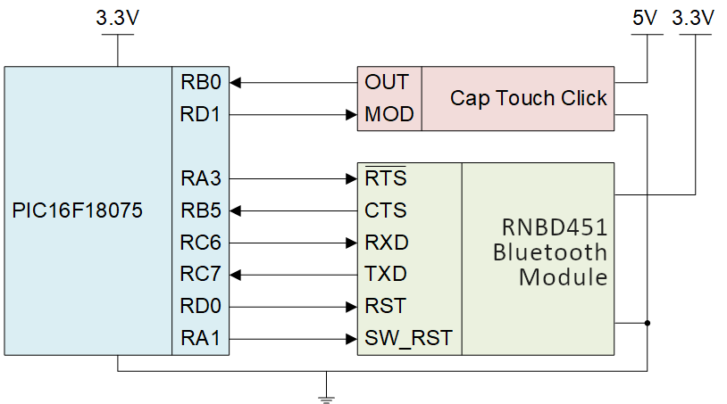

<!-- Please do not change this logo with link -->
[](https://www.microchip.com)

# Cubicle Doorbell

This example shows how configure a Cap Touch Click, an Adafruit NeoPixel, and two RN4678 Bluetooth Clicks into a doorbell which allows someone to get a coworker's attention if they are not diretly looking at the door of their cubicle.
<>

## Related Documentation

- [PIC16F18075 Data Sheet](https://ww1.microchip.com/downloads/en/DeviceDoc/PIC18F27-47-57Q43-Data-Sheet-DS40002147E.pdf) <!--Is this available online yet?-->
- [PIC16F18075 Family Product Page](https://www.microchip.com/wwwproducts/en/PIC16F18075)
- [RN4678 User Guide](https://ww1.microchip.com/downloads/en/DeviceDoc/RN4678-Bluetooth-Dual-Mode-Module-Command-Reference-User-Guide-DS50002506C.pdf)


## Software Used

- [MPLAB® X IDE](http://www.microchip.com/mplab/mplab-x-ide) **6.00** or newer
- [MPLAB® Xpress IDE](https://www.microchip.com/en-us/development-tools-tools-and-software/mplab-xpress) (alternative to MPLAB® X IDE) <!--Does this apply to this example?-->
- [MPLAB® XC8](http://www.microchip.com/mplab/compilers) **2.36** or a newer compiler 
- [MPLAB® Code Configurator (MCC)](https://www.microchip.com/en-us/tools-resources/configure/mplab-code-configurator) **4.1.0** or newer <!--Update/double check the version-->
- [MPLAB® Melody Library](https://www.microchip.com/en-us/tools-resources/configure/mplab-code-configurator) **1.37.25** or newer <!--Update/double check the version-->
- [Microchip PIC1F1xxxx Series Device Support pack](https://packs.download.microchip.com/) **1.10.170** or newer Device Pack

## Hardware Used
- [MPLAB® PICkit™ 4 In-Circuit Debugger](https://www.microchip.com/en-us/development-tool/PG164140)
- [Cap Touch Click](https://www.mikroe.com/cap-touch-click)
- [Adafruit NeoPixel](https://www.adafruit.com/product/1426)
- [RN4678 Bluetooth Click](https://www.mikroe.com/rn4678-click) x2
- Large Breadboard x2
- Jumper wires

## Setup - Wiring
### Door Module Wiring

The Door Module includes the Cap Touch Click and one RN4678 Bluetooth Click.  The Cap Touch Click is used for capturing if someone is at the door and the RN4678 Bluetooth Click is used to send the signal to the Desk Module.

The Cap Touch Click connects to the PIC16F18075 by connecting the OUT pin to any input pin. In this example, RB0 was selected as the input pin. The MOD pin on the Click determines the mode of operation and is connected to RD1. The Cap Touch Click shares the ground, both pins, with the PIC16F18075 but does not share the 5VDC power.

The RN4678 Bluetooth Click connects to the PIC16F18075 through the RTS, CTS, RXD, TXD, RST, and SW_RST pins. The CTS and TXD pins are configured as input pins while the RTS, RXD, RST, and SW_RST pins are configured as output pins. The RN4678 Bluetooth Click shares both the power (3.3VDC) and ground pins with the PIC16F18075. 

Figure 1 shows the connections made between the Cap Touch Click and RN4678 Bluetooth Click and the PIC16F18075 for the door module.

*Figure 1 - Door Module Circuit Diagram*


 Update to include power and ground

### Desk Module Wiring
The Desk Module includes the Adafruit NeoPixel and one RN4678 Bluetooth Click.  The Adafruit NeoPixel is used to get the attention of the person inside of the cubicle and the RN4678 Bluetooth Click is used to receive the signal from the Door Module.

The Adafruit NeoPixel connects to the PIC16F18075 by connecting the DIN pin to any output pin. In this example, RA0 was selected as the output pin. A 4-pin header will need to be soldered onto the back of the Adafruit NeoPixel before connecting to the PIC16F18075.  Figure 2 shows where to connect the 4-pin header (see the red box).  The Adafruit NeoPixel shares the ground, both pins, with the PIC16F18075 but does not share the 5VDC power. 

The RN4678 Bluetooth Click connects to the PIC16F18075 through the RTS, CTS, RXD, TXD, RST, and SW_RST pins. The CTS and TXD pins are configured as input pins while the RTS, RXD, RST, and SW_RST pins are configured as output pins. The RN4678 Bluetooth Click shares both the power (3.3VDC) and ground pins, both pins, with the PIC16F18075. 

Figure 3 shows the connections made between the Adafruit NeoPixel and RN4678 Bluetooth Click and the PIC16F18075 for the desk module.

*Figure 2 - Adafruit NeoPixel - back side*

**NEED TO INSERT IMAGE HERE - include a red box around the pins that need to be soldered to**

*Figure 3 - Desk Module Circuit Diagram *


## Setup - Programming
### Door/Desk Module Environment Setup
- Download, install, and open MPLABX IDE version 6.00 (or newer).

- Download and install the XC8 C-Compiler version 2.36 (or newer).

- Click on the new project (see the red box in Figure 4) button and name it.  This example uses the Standalone Project, the PIC16F18075 device (no tool selected yet), the XC8 compiler v2.36, and is named **pic16F18075-cubicle-doorbell-mplab-mcc.X** (see Figure 5).

*Figure 4 - New Project Button*


*Figure 5 - Name the New Project in MPLABX*


### Door/Desk MCC Setup
#### EUSART Configuration 

The EUSART Module is added to the project by locating it in the Device Resources pane on the left side in MCC.  Within the Drivers menu (expand if needed, red box in Figure 6) -> EUSART Menu (expand if needed, green box in Figure 6), click on the green plus next to where it says EUSART1 (blue box in Figure 6).

*Figure 6 - Device Resources - EUSART*


When the EUSART Driver is added, it appears in the Project Resources tab (see red box in Figure 7).

*Figure 7 - Project Resources - EUSART*


The EUSART module needs to be configured properly in order to generate the correct driver and APIs. There are a few possibilities you will see on your screen. Ultimately you will want your screen to match the one in Figure 8 below.  You may need to click on the solid black circle in the upper left hand of a window, or look around the sides for a 'EUSART1' tab and click on it.  Once your screen matches the one in Figure 8, you can continue on.

*Figure 8 - EUSART Configuration Tab*

 

Change the **Baud Rate** to 115200, as shown in Figure 9.

*Figure 9 - EUSART Configuration Tab with changes*


Notice how the **Baud Rate Error** is 8.507% (green box in Figure 9).
#### CLock Control Configuration

Just like the EUSART Configuration, get the window to match Figure 10 below.

*Figure 10 - Clock Control Configuration*

 

The changes are highlighted by the red boxes (see Figure 11 below):
- **Current Oscillator Source Select** needs to change to HFINTOSC_32Hz
- **HF Internal Clock** needs to change to 16_MHz

Double check that **System Clock** is 16000000 (after the two above changes, green box in Figure 11)

*Figure 11 - Clock Control Configuration Tab with changes*

 

Notice how the **Baud Rate Error** in the EUSART tab is now around 2% (green box in Figure 9).
#### Pin Configuration

The pins used in this example are configure using the Pins Grid View and the Pins tab.  The Pins Grid View is accessed by clicking on the Pins line in Project Resources as shown in Figure 12 below (red box).

*Figure 12 - Project Resources - Pins*

**NEED TO INSERT IMAGE HERE**

The changes to the Pins Grid View are listed below and highlighted by the red boxes (see Figure 13 below)
- **Pin RXX** is selected as a GPIO/EUSART Input/Output
- **Pin RXX** is selected as a GPIO/EUSART Input/Output
- **Pin RXX** is selected as a GPIO/EUSART Input/Output
- **Pin RXX** is selected as a GPIO/EUSART Input/Output

*Figure 13 - Pins Grid View*

**NEED TO INSERT IMAGE HERE**

The pins were also configured with custom names to make the generated APIs more readable (see Figure 14, red boxed).  The pin settings were also modified as shown in Figure 14 (green boxes)

*Figure 14 - Custon Pin Names and Settings*

**NEED TO INSERT IMAGE HERE**
### Code Implementation

Click Generate within the Project Resources Menu (Figure 15).

*Figure 15 - Generate the code*

**NEED TO INSERT IMAGE HERE**

First, the code needs several more functions in order to operate correctly.  This will be done by including one additional header file and one additional main.c file which will contain all of the functions for this example. To make a new header file, right click on header files in the Project tab in the pane on the left of the screen and select [option to make new .h file].
- Insert image of right click with selection hightlighted

Next steps:
- Finish making a new .h file (include images as needed)
- copy the .h file contents from this example navigate to [provided file path] and paste it over the new document that is made in MPLAB
- rename file to "application.h"
- follow similar steps for application.c
- copy the .c file contents from this example navigate to [provided file path] and paste it over the new document that is made in MPLAB
- Include both function tables of what the function is and what they do
- add the needed lines of code to MCC.c and MCC.h to include the initialization functions into the main system_initialize function
- explain how to duplicate the main.c file so that there is one for the door module and one for the desk module
- include both code snippets on what to include in each module's main.c file
- explain how to setup a second configuration
- show how to remove one a file from each of the configurations
- connect the PICKit to the PIC (see step 4 below)
- select correct configuration (from the two made above)
- select the correct programming device
- make and program each device
- Operation section and below should be good to go


**Step 4:** Connect the PICKit 4 to the PIC16F18075 as shown in Figure 7.

*Figure 7 - PICKit to PIC16F18075 connections (includes pin number)*

**NEED TO INSERT IMAGE HERE - same design as above **

**Step 5:** Select the correct configuration as shown in Figure 8 by using Table 1 with the known Door/Desk Module and the Free/Pro setting

*Figure 8 - Configuration List for MPLABX*

**NEED TO INSERT IMAGE HERE - snip from MPLAB when all configurations have been setup **

*Table 1 - Configuration List selection by Module and Free/Pro setting*

| Module      | Free/Pro | Configuration     |
| :---        |    :----:   |          ---: |
| Door      | Pro       | pro_door   |
| Door   | Free        | free_door      |
| Desk   | Pro        | pro_desk      |
| Desk   | Free        | free_desk      |


**Step 6:** Press the 'Project Properties' button to open the Project Properties window.  Select the PICKit 4 from the Tools drop-down menu as shown in Figure 9

*Figure 9 - Select the PICKit 4 from Tools Menu*

**NEED TO INSERT IMAGE HERE - snip from MPLAB when all configurations have been setup **

**Step 7:** Press the 'Make and Program Device' button to program the PIC16F18075 (see Figure 10).  Verify that the device was successfully programmed (see Figure 11)

*Figure 10 - Make and Program Device Button*

**NEED TO INSERT IMAGE HERE - snip from MPLAB when all configurations have been setup **

*Figure 11 - Device Programming Successful*

**NEED TO INSERT IMAGE HERE - snip from MPLAB when all configurations have been setup **

### NeoPixel Functions
There are 7 functions used to control the NeoPixel in this example. Each function and description is listed in Table 2.

*Table 2 - NeoPixel Functions and Descriptions*

| Function      | Description |
| :----:        |    :----:   |
| ``` onePulse() ```      | Send a 1-code, a HIGH, using the correct timing to the NeoPixel       |
| ``` zeroPulse() ```   | Send a 0-code, a LOW, using the correct timing to the NeoPixel        |
| ``` ws_send_byte(K) ``` **CHANGE NAME OF FUNCTION**   | Check the K byte for if you should send a 1-code or 0-code        |
| ```LED_Array(R, G, B)```|Input the values R,G,B (max of 255) to set the brightness for each color for an individual LED. Sends in the correct order so the NeoPixel can understand|
| ``` RED() ```   | Make all 8 LEDs turn to the brightest Red possible        |
| ``` OFF() ```   | Turn all 8 LEDs off        |
| ``` RED_BLINK_500ms ```| All 8 LEDs blink Red and then turn off at a 500ms interval        |

### RN4678 Functions
There are 5 functions used to control the RN4678 in this example. Each function and description is listed in Table 3.
  
*Table 3 - RN4678 Functions and Descriptions*

| Function   | Description |
| :----:       |    :----:   |
| ``` BT_initialConditions() ```  | Set initial conditions for RN4678 Click |
| ``` BT_initialize() ```  | Put the RN4678 Click into a state where is it able to recieve EUSART data |
| ``` BT_enterCommandMode() ```  | Sends the '$$$' command over EUSART which enters the RN4678 Click into Command Mode |
| ``` BT_scan() ```  | Scan for available Bluetooth Connections |
| ``` BT_connect() ```  | Connect to the device which matches the specificed MAC address (stored within the function)  |

## Operation
After having programmed both the desk and door module circuits, the result will not not visible immediately. Once both modules have power, the desk module will initiate the ``` BT_scan() ``` function which takes about 20 seconds to complete.  After that 20 seconds is done, the 'STAT2' LED on the RN4678 Click shown in Figure 12 (in the red box) turns off.

*Figure 12 - RN4678 STAT2 LED*

**NEED TO INSERT IMAGE HERE - don't forget the red box around the STAT2 LED**


*Scan completing and LEDs turning off*

**NEED TO INSERT VIDEO HERE - wait until all new configurations have been tested**

Once the scan completes and the STAT2 LED turns off on each RN4678 Bluetooth Click, then when the Cap Touch Click is pressed on the door module, the AdaFruit NeoPixel will flash on the desk module.

*Cap Touch Click being pressed and the AdaFruit NeoPixel flashing*

**NEED TO INSERT VIDEO HERE - wait until all new configurations have been tested**

### How to change any other Bluetooth settings

The RN4678 Bluetooth Click has many different settings that are not described within this example.  For any additional setting changes the following steps should be followed:
     
1. Make sure that all the RN4678 Bluetooth Click pins are connected to the PIC16F18075 (see Figure 4 or Figure 5 above)

2. Disconnect the TXD and RXD connections between the PIC16F18075 and the RN4678 Bluetooth Click.

3. Using a USB to UART device, connect the TXD and RXD pins from the RN4678 Bluetooth Click to that device.

4. Now follow the instructions used with the command guide for changing any of the settings.  The command guide can be found above under the link labeled 'RN4678 User Guide'.
     
## Summary
This example has shown how to use a Cap Touch Click, an AdaFruit NeoPixel, and 2 RN4678 Bluetooth Click modules to create a Cubicle Doorbell system that uses the PIC16F18075 device within the MCC tool in MPLABX.